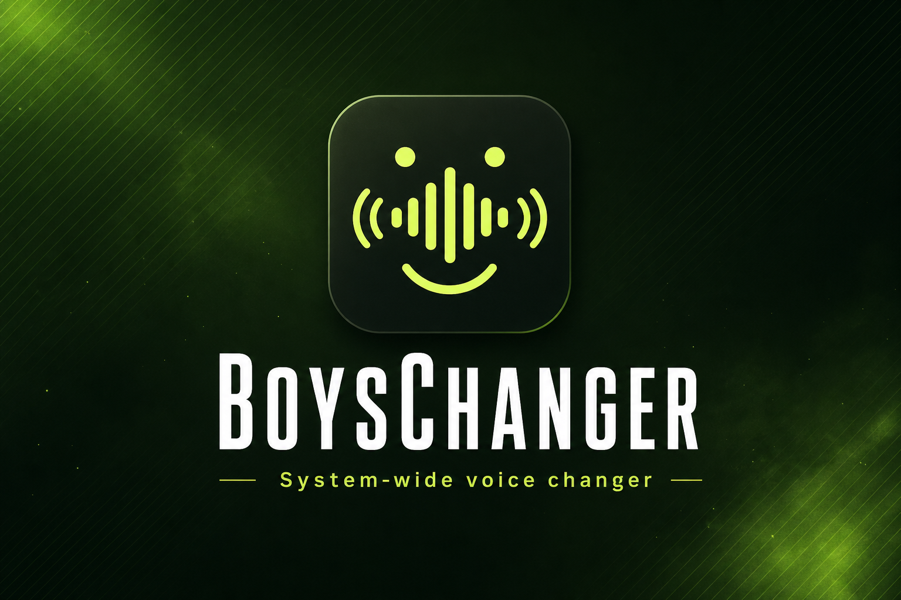

# BoysChanger

<p align="center">
  
</p>

<p align="center">
  
</p>

<p align="center">
  <strong>English</strong> ·
  <a href="README.ru.md">Русский</a> ·
  <a href="README.zh.md">中文</a> ·
  <a href="brand/TELEGRAM_ANNOUNCE.md">📣 Telegram announce</a>
</p>

<p align="center">
  <strong>System-wide voice changer for Windows and macOS</strong><br/>
  by <a href="https://github.com/HyperlinksSpace">HyperlinksSpace</a>
</p>

<p align="center">
  <a href="https://hyperlinksspace.github.io/BoysChanger/">Website</a> ·
  <a href="https://github.com/HyperlinksSpace/BoysChanger/releases/latest">Downloads</a> ·
  <a href="https://www.hyperlinks.space/">Hyperlinks Space</a> ·
  <a href="brand/boyschanger-social.png">Social image</a>
</p>

Shape race, gender, age, timbre, amplifier, and volume; stack echo, wah-wah, distortion, reverb, chorus, robot, flanger, and bitcrush; prehear the last **11 seconds**; route the result through a virtual cable as your OS microphone.

> **Auto-update note:** Install from the [latest Release](https://github.com/HyperlinksSpace/BoysChanger/releases/latest) once if you are on 1.0.5 or earlier — those builds used prerelease-style Git tags and skipped updates. From **v1.0.6+** updates apply automatically.

## Features

- **ON/OFF** master toggle for the voice changer
- **Character controls**: race, gender, age, timbre, amplifier, volume
- **Effects**: all can be enabled at the same time, with a shared mix slider
- **Prehear**: replay the last 11 seconds of processed voice
- **Sound library**: built-in FX + upload your own MP3 (plays locally and into the virtual cable)
- **System-wide routing**: bundled **VB-CABLE** on Windows (install from the app or NSIS setup); **BlackHole** on macOS; then set it as the system / Telegram mic
- **Languages**: English, 中文, Русский (follows system language on first launch)
- **Auto-update**: checks GitHub Releases and installs updates automatically
- **Auto-release**: every push to `main` builds installers and publishes a GitHub Release
- **GitHub Pages** site with presentation + download links (`/site`)

## Setup (users)

### Windows

1. Install BoysChanger from [Releases](https://github.com/HyperlinksSpace/BoysChanger/releases) — the installer **bundles VB-CABLE** (VB-Audio donationware) and can install it during setup
2. **Reboot** after VB-CABLE install (required for the driver to appear)
3. In the app, set **Input** to your **real hardware mic** (not Voicemod / CABLE)
4. Set **Output** to **CABLE Input** (auto-selected when the cable is found)
5. Click **Setup for Telegram** / **Apply as system input**
6. Turn the changer **ON**

If the cable is missing: open the Telegram setup panel → **Install virtual cable** (runs the bundled installer; accept the Windows driver prompt).

VB-CABLE is by [VB-Audio](https://www.vb-cable.com/) (donationware — donations welcome).

Optional: `Install-Module AudioDeviceCmdlets` is no longer required; BoysChanger can set the default mic without it.

### macOS

1. Install [BlackHole 2ch](https://existential.audio/blackhole/)
2. Install BoysChanger from Releases (unsigned CI builds: right-click → Open the first time)
3. Set **Output** to **BlackHole 2ch**
4. Click **Apply as system input** (or set Sound input to BlackHole)
5. Turn the changer **ON**

Optional: `brew install switchaudio-osx` for automatic input switching.

### Telegram / Discord voice chat

Telegram Desktop **does not** automatically use BoysChanger. It has its own Call microphone setting, and voice messages often use the **Windows/macOS default** mic.

1. Install **VB-Cable** via BoysChanger (**Install virtual cable** / Windows installer) or **BlackHole** (Mac)
2. BoysChanger: **Input** = real mic, **Output** = **CABLE Input** / **BlackHole**
3. Click **Setup for Telegram** in the app (or **Apply as system input**)
4. Telegram Desktop → **Settings → Advanced → Call settings → Input device** = **CABLE Output** / **BlackHole**
5. **Leave and rejoin** the voice chat (Telegram locks the mic at call start)
6. Keep BoysChanger **ON** while talking

For **voice messages** on Windows: also set the default Recording device to **CABLE Output** (Sound settings → Recording).

Mobile Telegram cannot use a virtual cable.

Sound-library clips and prehear playback go to **both** your speakers and the virtual cable, so the other side hears them too.

### Debug logs

The app writes rolling logs to:

- `%APPDATA%\BoysChanger\logs\boyschanger.log` (Windows)
- and, in dev, `logs/boyschanger.log` in the project folder

Use the **Logs** button in the app to open the folder. Share that file when reporting audio issues.

Each Prehear **Play** also saves the last **2** captures as WAV + JSON next to the log:

- `prehear-1.wav` / `prehear-1.json` — newest
- `prehear-2.wav` / `prehear-2.json` — previous

JSON includes `rms`, `peak`, `seconds`, and `silent` for quick diagnosis.

### Auto-update

Packaged builds poll GitHub Releases about every **30 minutes**, retry on flaky network errors (`ERR_CONNECTION_CLOSED`, etc.), fall back to the GitHub API, download updates automatically, and relaunch into the new version. Public repos need no token. Optional: set `GH_TOKEN` / `GITHUB_TOKEN` (repo scope) if GitHub rate-limits or blocks anonymous requests on your network.

## Social / Telegram

- 📣 Ready-to-paste Russian Telegram post: [`brand/TELEGRAM_ANNOUNCE.md`](brand/TELEGRAM_ANNOUNCE.md)
- Multilingual announce text: [`brand/ANNOUNCE.md`](brand/ANNOUNCE.md)
- Social image: [`brand/boyschanger-social.png`](brand/boyschanger-social.png)

## Develop

```bash
npm install
npm run dev
```

Build locally:

```bash
npm run pack:win   # Windows
npm run pack:mac   # macOS
```

## GitHub automation

| Workflow | Trigger | Result |
|---|---|---|
| `.github/workflows/release.yml` | Push to `main` / `master` | Windows + macOS builds → GitHub Release |
| `.github/workflows/pages.yml` | Push to `main` / `master` | Deploys presentation site |

Enable **Settings → Pages → GitHub Actions** after the first Pages workflow run.

Site: https://hyperlinksspace.github.io/BoysChanger/

## Brand

- Mark (SVG): [`brand/logo.svg`](brand/logo.svg) — scales from favicon to app icon
- Compact mark: [`brand/logo-mark.svg`](brand/logo-mark.svg)
- Banner: [`brand/banner.png`](brand/banner.png)
- Social announce image: [`brand/boyschanger-social.png`](brand/boyschanger-social.png)

## License

MIT